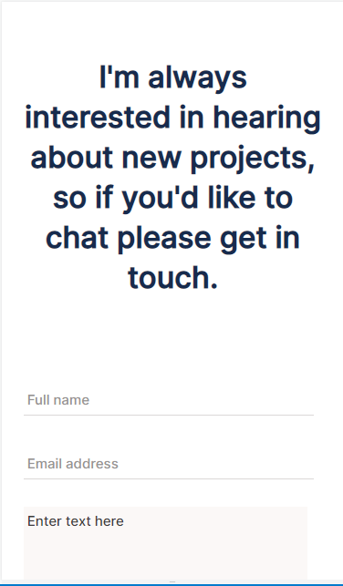
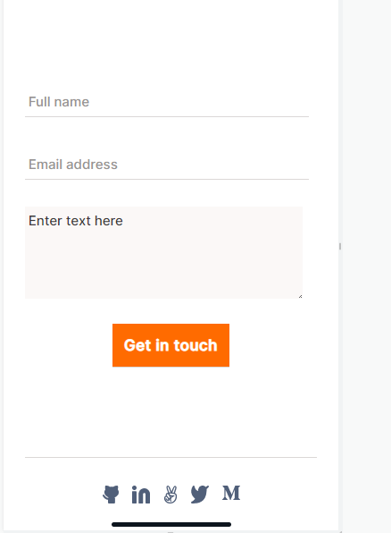

# My Portfolio

> This is my second project in the Microverse in which I built my portfolio . This is the step for the contact form. The objective was to build template from figma by using CSS Flexbox. For that I created my-portfolio repo and cloned into my local machine. For best practices I have implemented linter,Github Flow and professional documentation as much as I can. For the reference, you can click [here](https://www.figma.com/file/l7SqJ3ZfkAKih9sFxvWSR4/Microverse-Student-Project-1?node-id=48%3A27) to look at the template I chose.

## Built With

- HTML, CSS
- Linters, Markdown
- GitHub Flow 

## Getting Started

To get a local copy up and running follow these simple example steps.

1) Enter `git clone git@github.com:basnetlaxmi/my-portfolio.git` into terminal

2) Open in browser to view site

### Prerequisites

- Code editor

- Git and Github

## Author

👤 **Laxmi Basnet**

- GitHub: [@basnetlaxmi](https://github.com/basnetlaxmi)
- LinkedIn: [LinkedIn](https://np.linkedin.com/in/laxmi-basnet-b22403131)

## 🤝 Contributing

Contributions, issues, and feature requests are welcome!

Feel free to check the [issues page](../../issues/).

## Show your support

Give a ⭐️ if you like this project!

## Acknowledgments

- Microverse learning partners
- Microverse

## 📝 License

This project is [MIT](./MIT.md) licensed.
